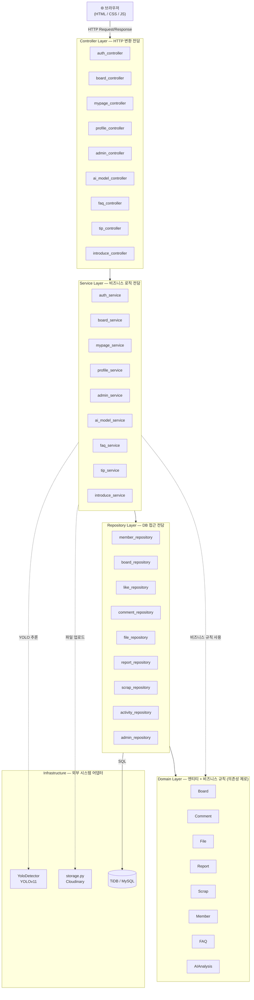

# 🛣 도(道)서관 — The Road Library

> AI 기술을 활용해 도로 위 위험 요소를 실시간으로 분석하고,  
> 운전자들이 서로의 경험과 지식을 공유하는 안전 주행 통합 플랫폼

---

## 📁 프로젝트 구조 (Project Structure)

```
project-root/
├── app.py                        # Flask 앱 진입점
├── requirements.txt
├── .env
│
├── src/                          # 핵심 소스 코드
│   ├── domain/                   # 비즈니스 엔티티 (의존성 제로)
│   │   ├── board.py
│   │   ├── comment.py
│   │   ├── file.py
│   │   ├── report.py
│   │   ├── scrap.py
│   │   ├── member.py
│   │   ├── faq.py
│   │   ├── ai_analysis.py
│   │   └── __init__.py
│   │
│   ├── repository/               # DB 접근 전담 (SQL만)
│   │   ├── board_repository.py
│   │   ├── like_repository.py
│   │   ├── comment_repository.py
│   │   ├── file_repository.py
│   │   ├── report_repository.py
│   │   ├── scrap_repository.py
│   │   ├── member_repository.py
│   │   ├── activity_repository.py
│   │   ├── faq_repository.py
│   │   ├── profile_repository.py
│   │   ├── ai_model_repository.py
│   │   ├── admin_repository.py
│   │   └── __init__.py
│   │
│   ├── service/                  # 비즈니스 로직 전담
│   │   ├── board_service.py
│   │   ├── auth_service.py
│   │   ├── faq_service.py
│   │   ├── introduce_service.py
│   │   ├── mypage_service.py
│   │   ├── profile_service.py
│   │   ├── tip_service.py
│   │   ├── ai_model_service.py
│   │   ├── admin_service.py
│   │   └── __init__.py
│   │
│   ├── controller/               # HTTP 변환 전담
│   │   ├── board_controller.py
│   │   ├── auth_controller.py
│   │   ├── faq_controller.py
│   │   ├── introduce_controller.py
│   │   ├── mypage_controller.py
│   │   ├── profile_controller.py
│   │   ├── tip_controller.py
│   │   ├── ai_model_controller.py
│   │   ├── admin_controller.py
│   │   └── __init__.py
│   │
│   ├── infrastructure/           # 외부 시스템 어댑터
│   │   └── yolo_detector.py      # YOLOv11 모델 래퍼
│   │
│   └── common/
│       ├── db.py                 # DB 연결
│       ├── storage.py            # Cloudinary 업로드
│       └── ...
│
├── static/
│   ├── css/
│   │   └── main.css              # 전역 CSS 변수 (:root)
│   ├── js/
│   ├── img/
│   ├── logo/
│   └── model/
│       └── best.pt               # YOLOv11 모델 파일
│
└── templates/
    ├── admin/
    ├── ai_model/
    ├── auth/
    ├── board/
    ├── faq/
    ├── intro/
    ├── layout/
    ├── mypage/
    ├── tip/
    ├── 404.html
    ├── base.html
    └── main.html
```

---

## 🏛 아키텍처 (Clean Architecture)

본 프로젝트는 **Clean Architecture** 원칙을 적용하여 레이어를 분리했습니다.



### 레이어별 책임

| 레이어 | 책임 | 규칙 |
|--------|------|------|
| **Controller** | HTTP 요청/응답 변환 | session 파싱, jsonify, render_template만 |
| **Service** | 비즈니스 로직 | 권한 판단, 파일 검증, 연계 처리 |
| **Repository** | DB 접근 | SQL 쿼리만, 로직 없음 |
| **Domain** | 엔티티 + 비즈니스 규칙 | 외부 의존성 제로 |
| **Infrastructure** | 외부 시스템 | YOLOv11, Cloudinary |

### 의존성 방향 규칙
- 화살표는 항상 안쪽(Domain)으로만 향합니다.
- Domain은 아무것도 import하지 않습니다.
- Controller는 Service만 호출하고, DB에 직접 접근하지 않습니다.

### 예외 처리 규칙

| Service가 던지는 예외 | Controller가 변환하는 응답 |
|----------------------|--------------------------|
| `ValueError` | 400 / `_alert_back()` |
| `PermissionError` | 403 / `_alert_back()` |
| `RuntimeError` | 500 |

---

## 🛠 환경 설정 (Environment Setup)

### 0. 가상환경(venv) 설정
라이브러리 충돌을 방지하기 위해 프로젝트 전용 가상환경을 생성하는 것을 권장합니다.

```bash
# 1. 가상환경 생성
python -m venv venv

# 2. 가상환경 활성화
# Windows:
venv\Scripts\activate
# macOS/Linux:
source venv/bin/activate
```

### 1. 새로운 라이브러리 설치 및 반영
```bash
# 1. 모듈 설치
pip install <모듈이름>

# 2. 패키지 목록을 requirements.txt에 저장
pip freeze > requirements.txt
```

### 2. 의존성 라이브러리 일괄 설치
```bash
# 저장된 모든 라이브러리 설치
pip install -r requirements.txt
```

### 3. 환경 변수(.env) 설정
```bash
# 1. 프로젝트 루트 디렉토리에 .env 파일을 생성합니다.
# 2. 노션 키파일에 공유된 .env 파일을 root 디렉토리에 생성
```

> 💡 새로운 패키지 설치 후 `pip freeze > requirements.txt`를 실행하는 습관을 가져주세요!

---

## 📐 팀 내 코드 규칙 (Code Convention)

> ★★★★★ 반드시 이 부분을 필독해주세요.

### 1. 파일 네이밍
- **Service** 파일명은 항상 `***_service.py`로 지어주세요.
- **Controller** 파일명은 항상 `***_controller.py`로 지어주세요.
- **Repository** 파일명은 항상 `***_repository.py`로 지어주세요.

### 2. 레이어별 역할 준수
Controller에서 직접 DB에 접근하지 마세요.
반드시 Service → Repository 순서를 지켜주세요.

```python
# ❌ Controller에서 직접 DB 접근
@board_bp.route('/list')
def board_list():
    rows = fetch_query("SELECT * FROM boards")   # 금지
    return render_template(...)

# ✅ Controller → Service → Repository
@board_bp.route('/list')
def board_list():
    result = board_service.get_board_list(...)   # Service 호출
    return render_template('board/list.html', **result)
```

### 3. 템플릿 경로 규칙
`html`을 만들 때 `templates/기능명` 디렉터리 안에 넣어주세요.

```python
# ✅ 올바른 템플릿 경로
return render_template('board/list.html', ...)
return render_template('auth/login.html', ...)
return render_template('mypage/info.html', ...)
```

### 4. 정적 파일 경로 규칙
`img` 태그 안에 src 속성을 넣을 때 항상 `url_for`를 사용하세요.

```html
<!-- ❌ 하드코딩 — 배포 환경에서 경로가 바뀌면 깨짐 -->


<!-- ✅ url_for — Flask가 환경에 맞게 경로를 자동 생성 -->

```

정적 파일 디렉터리 구조:
- 이미지: `static/img/`
- 로고: `static/logo/`
- CSS: `static/css/`
- JS: `static/js/`

### 5. CSS 전역 변수
전체적인 테마를 나타내는 색상 변수는 `/static/css/main.css`의 `:root` 안에 넣어주세요.

```css
:root {
    --primary-teal: #20828A;
    --dark-charcoal: #212529;
    --light-teal: #fff;
    --communa-primary: #20828A;
    --communa-hover: #186b72;
    /* ← 여기에 새로 추가 */
}
```

### 6. 비즈니스 규칙은 Domain에
조건 판단 로직은 Controller/Service에 인라인으로 쓰지 말고 Domain 메서드로 만들어주세요.

```python
# ❌ Controller에 인라인
if row['member_id'] != session.get('user_id'):
    return "권한 없음"

# ✅ Domain 메서드 활용
if not board.can_be_edited_by(user_id, user_role):
    raise PermissionError("수정 권한이 없습니다.")
```

### 7. 예외 처리 규칙
Service는 예외를 던지고, Controller가 HTTP 응답으로 변환합니다.

```python
# ✅ Service — 예외만 던짐
def delete_board(self, board_id, user_id, user_role):
    if not board.can_be_deleted_by(user_id, user_role):
        raise PermissionError("삭제 권한이 없습니다.")

# ✅ Controller — HTTP 변환만
try:
    board_service.delete_board(board_id, user_id, user_role)
except PermissionError as e:
    return f"<script>alert('{e}'); history.back();</script>"
```

### 8. 디렉터리 명칭
기존 `LMS` 디렉터리에서 `src` 디렉터리로 변경하였습니다.  
기존 `LMS`는 프로젝트 디렉터리 명칭으로 올바르지 않아서 적절한 이름인 `src`로 변경하였습니다.

---

## 🔗 주요 Blueprint URL 구조

| Blueprint | URL Prefix | 담당 기능 |
|-----------|------------|----------|
| `auth_bp` | `/auth` | 로그인, 회원가입, 로그아웃 |
| `board_bp` | `/board` | 게시판 CRUD, 좋아요, 댓글, 신고 |
| `mypage_bp` | `/mypage` | 마이페이지, 프로필, AI 분석 결과 |
| `profile_bp` | `/profile` | 유저 프로필, 팔로우, 차단 |
| `admin_bp` | `/admin` | 관리자 대시보드, 회원/게시글 관리 |
| `model_bp` | `/model` | AI 모델 추론, 영상 스트리밍 |
| `faq_bp` | `/faq` | FAQ 조회 |
| `introduce_bp` | `/introduce` | 서비스 소개 |
| `tip_bp` | `/tip` | 운전 팁 |

## 📡 API 명세서

[서관-20828A?style=for-the-badge)](https://mbcacademy3-3team.github.io/the-road-library/api_docs.html)

👉 [API 명세서 바로가기](https://mbcacademy3-3team.github.io/the-road-library/api_docs.html)

## 📋 기능 명세서

자세한 기능 명세는 [features.md](docs/features.md)를 참고하세요.